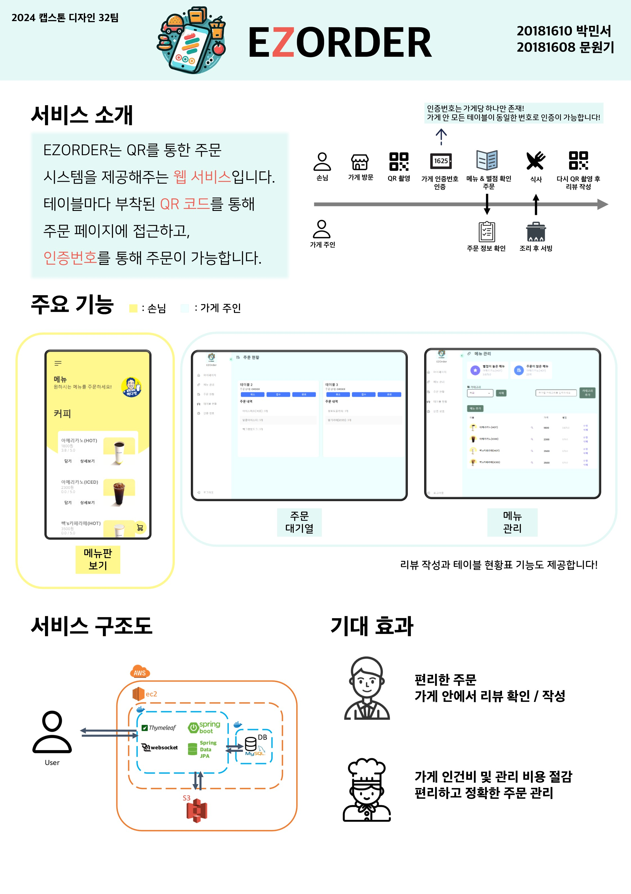
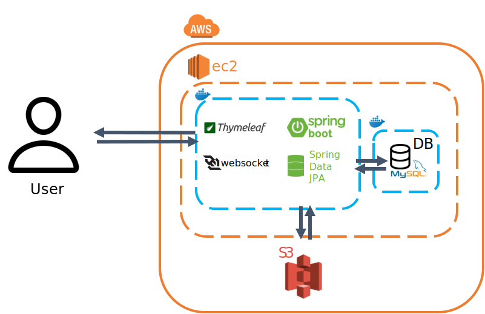

[](https://classroom.github.com/a/omXkVCQu)
[](https://classroom.github.com/online_ide?assignment_repo_id=13986452&assignment_repo_type=AssignmentRepo)
# 🍱 EZOrder

2024 캡스톤디자인 32조

<br/>

## 목차
  - [📝 프로젝트 소개](#-프로젝트-소개)
  - [🔍️ 주요 기능](#️-주요-기능)
  - [👷 팀원 소개](#-팀원-소개)
  - [🚀 프로젝트 구조](#-프로젝트-구조)
  - [✅ 기대 효과](#-기대-효과)
  - [✨ 기술 스택](#-기술-스택)
  - [🔧 배포 가이드](#-배포-가이드)
  - [🗃️ 관련 자료](#-관련-자료)

<br/>

## 📝 프로젝트 소개

<code>음식점 QR 주문 웹 서비스</code>
<br/>

손님은 QR 코드를 찍기만 해도 웹으로 쉽게 주문을 할 수 있고, 가게 사장님은 주문 내역을 쉽게 보고 처리할 수 있도록 도와주는 것을 목표로 합니다.

비슷한 아이디어를 가진 서비스가 이미 현업에 존재하지만, EZOrder는 앱을 설치하거나 로그인을 하는 것과 같은 불편한 과정이 존재하지 않아 손님 입장에서 편하게 주문할 수 있습니다.

또한 가게 입장에서는 키오스크나 테이블 별 태블릿 설치와 같은 추가적인 설비가 필요하지 않다는 장점이 있습니다.


<br/>

## 🔍️ 주요 기능

 <code> QR 스캔을 통한 편한 주문 </code>
 <br/>
 
 테이블마다 부착되어 있는 QR 코드 스캔을 통해, 그 자리에서 편하게 주문이 가능합니다.
 <br/>
 <br/>

 <code> 악성 주문을 막는 인증번호 시스템 </code>
 <br/>

 반드시 현장에 있는 사람만이 주문을 할 수 있도록, 인증번호 시스템을 도입했습니다.

 ```
 주문을 하기 위해서는 '가게의 인증번호'를 알아야 합니다.
 해당 인증번호로 가게 안 모든 테이블에서 주문이 가능합니다.
 가게 주인은 인증번호를 잘 보이는 곳 (ex: 시계 옆, 메인 홀 벽면 등등)에 배치하여, 손님들이 간편하게 확인할 수 있도록 해야합니다.
 ```
 <br/>
 <br/>

 <code> 실제 주문자만 적을 수 있는 검증된 리뷰 </code>
 <br/>

 주문한 사람만 리뷰를 적을 수 있는 시스템이기에 신뢰도 있는 리뷰를 볼 수 있습니다.
 <br/>
 <br/>

 <code> 편한 메뉴 관리 시스템 </code>
 <br/>
 
 가게 운영자는 편하게 메뉴판을 수정할 수 있습니다.
 <br/>
 <br/>

 <code> 편하게 볼 수 있는 가게 현황 </code>
 <br/>

 가게 운영자 입장에서 주문 대기열, 테이블 별 주문 현황을 파악할 수 있어 탄력적인 관리가 가능합니다.
 
 <br/><br/>



<br/><br/>

## 👷 팀원 소개


```
이름 : 박민서

학번 : xxxx1610

이메일 : minseo1224@kookmin.ac.kr

역할 : Leader, Back-end, Front-end
```


```
이름 : 문원기

학번 : xxxx1608

이메일 : wkm99@kookmin.ac.kr

역할 : Back-end, Front-end
```

<br/><br/>


## 🚀 프로젝트 구조 


<code> 시나리오 </code>  


<br/>


<code> 시스템 구조도 </code>  




<br/><br/>

## ✅ 기대 효과

<code> 초기 설비 비용을 비약적으로 줄일 수 있습니다. </code>
 <br/>

기존의 주문 방식은 키오스크나 테이블마다 배치된 테블릿을 이용하는 방식으로, 이는 주로 인건비를 절감하기 위한 수단으로 등장했습니다. 

그러나 이러한 방식은 설치와 운용에 따른 비용 부담도 크다는 단점이 있었습니다.

EZOrder를 통해 이러한 비용을 혁신적으로 줄일 수 있습니다.
<br/>
<br/>

<code> 생생하고 신뢰도 높은 리뷰를 확인할 수 있습니다. </code>
 <br/>
 
저희의 리뷰 시스템은 QR 인증과 쿠키를 활용하여 더욱 신뢰할 수 있는 리뷰를 제공합니다.

음식을 직접 주문한 손님들에 의해 작성된 리뷰만을 수용하며, 이를 통해 손님들은 생생하고 신뢰할 수 있는 정보를 얻을 수 있습니다.

더불어, 리뷰 작성은 음식을 주문한 후 2시간 이내에 이루어져야 하므로, 음식을 먹은지 얼마 안 된 손님들의 의견만이 반영됩니다. 이러한 체계는 가게 입장에서도 실시간으로 피드백을 받을 수 있어, 빠른 조치와 서비스 개선에 도움을 줍니다.

<br/>
<br/>

<code> 가게 주인은 매장의 전반적인 관리를 손쉽게 수행할 수 있습니다. </code>
 <br/>
 
매장 내 테이블 현황을 실시간으로 파악하고, 주문 대기열을 즉각 확인할 수 있습니다.

각 주문의 테이블 출처와 처리 상태를 간편하게 확인할 수 있으며, 메뉴판을 손쉽게 추가, 삭제, 수정할 수 있습니다.

더불어, 가게 사정에 따라 메뉴를 변경해야 할 경우에도 즉각적으로 메뉴판을 업데이트할 수 있습니다.
<br/>
<br/>

## ✨ 기술 스택
<div align=left>
  
  
  
  
  
  
</div>

<br/>
<br/>

## 🔧 배포 가이드

**1) AWS ec2 서버 인스턴스를 실행 후, ssh 터미널로 접속한다.**

-> 본 가이드는 ubuntu를 기준으로 작성되었다.

**2) Amazon S3 버킷을 생성한다.**

S3 버킷을 생성할 때, ACL을 활성화하고 퍼블릭 엑세스를 허용한다.
S3 버킷 사용자를 생성하고, 해당 사용자의 access-key와 secret-key를 기록한다.

**3) 해당 git repository의 master 브랜치를 Clone한다.**

```shell
$ git clone https://github.com/kookmin-sw/capstone-2024-32.git
```

**4) 해당 디렉토리에 접근하여 setup.sh 쉘 스크립트를 실행한다.**

```shell
$ chmod +x setup.sh
$ ./setup.sh
```

-> 도중에 뜨는 do you want to continue와 같은 부분에서는 모두 승인한다.

**5) docker-compose.yaml 파일을 수정한다.**

services.mysql.environment에서
MYSQL_ROOT_PASSWORD에 루트 비밀번호를 작성한다.
그 후에 services.spring-app.environment에 .
SPRING_DATASOURCE_PASSWORD에 위에 작성한 루트 비밀번호를 작성한다.

**6) src/main/resources/application.yaml을 수정한다.**

spring.datasources.password에 위에 작성한 루트 비밀번호를 작성한다.
그 후에 qrcode.url에 현재 ec2 인스턴스의 퍼블릭 IPv4 DNS 주소:8080을 작성한다.
그 후에 버킷명과 액세스키, 시크릿키를 cloud.aws.s3.bucket과 credentials.access-key, credentials.secret-key에 입력한다.

**7) 이후에 docker compose와 gradlew을 통해 빌드한 후 실행한다.**

```shell
$ sudo docker compose up -d mysql     # MySQL 컨테이너 실행
$ chmod 755 ./gradlew   # gradle 활용하여 빌드
$ ./gradlew clean build
$ sudo docker compose build spring-app   # Spring 애플리케이션 빌드
$ sudo docker compose up -d # 빌드된 파일 전부 실행
```

**8) 확인**

퍼블릭 IPv4 DNS 주소에 8080 포트로 접속하면 해당 application이 작동하는지 확인할 수 있다.

<br/>
<br/>


## 🗃️ 관련 자료

<br/>

[중간보고서](https://github.com/kookmin-sw/capstone-2024-32/blob/master/docs/%EC%BA%A1%EC%8A%A4%ED%86%A4%EB%94%94%EC%9E%90%EC%9D%B8_%EC%A4%91%EA%B0%84%EB%B3%B4%EA%B3%A0%EC%84%9C_32%ED%8C%80.pdf)

<br/>

[중간발표자료](https://github.com/kookmin-sw/capstone-2024-32/blob/master/docs/%EC%A4%91%EA%B0%84%EB%B0%9C%ED%91%9C%EC%9E%90%EB%A3%8C_32%ED%8C%80.pdf)

<br/>

[수행결과보고서](https://github.com/kookmin-sw/capstone-2024-32/blob/master/docs/%ED%8C%8032-%EC%88%98%ED%96%89%EA%B2%B0%EA%B3%BC%EB%B3%B4%EA%B3%A0%EC%84%9C.docx)
