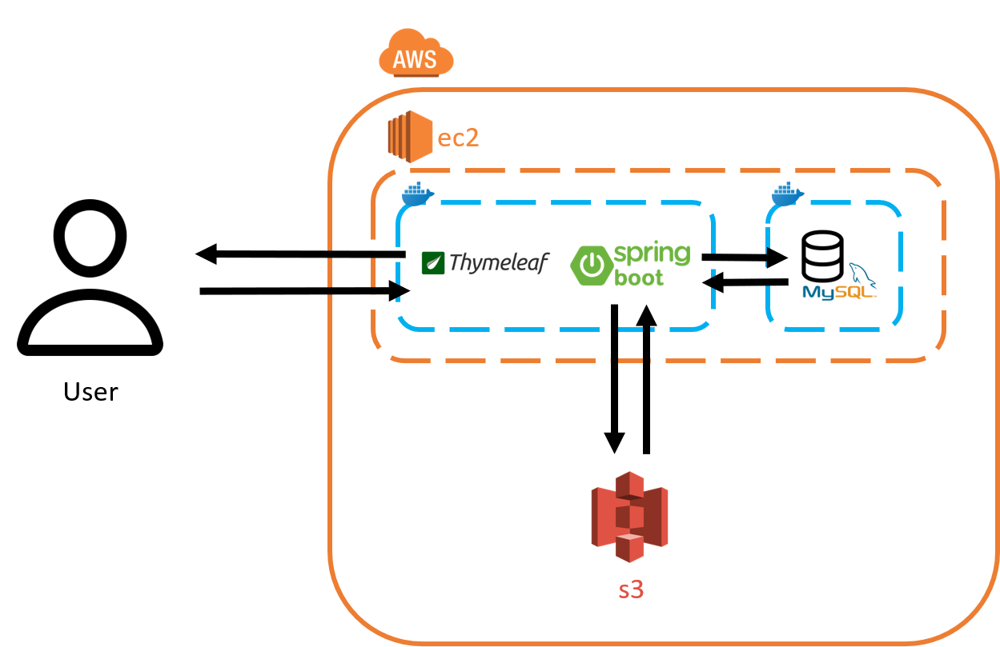

# 🍱 EZOrder

2024 캡스톤디자인 32조

<br/>

## 목차
  - [📝 프로젝트 소개](#-프로젝트-소개)
  - [🔍️ 주요 기능](#️-주요-기능)
  - [👷 팀원 소개](#-팀원-소개)
  - [🚀 프로젝트 구조](#-프로젝트-구조)
  - [✅ 기대 효과](#-기대-효과)
  - [✨ 기술 스택](#-기술-스택)

<br/>

## 📝 프로젝트 소개

<code>음식점 QR 주문 웹 서비스</code>
<br/>

<aside>

손님은 QR 코드를 찍기만 해도 웹으로 쉽게 주문을 할 수 있고, 가게 사장님은 주문 내역을 쉽게 보고 처리할 수 있도록 도와주는 것을 목표로 합니다.

비슷한 아이디어를 가진 서비스가 이미 현업에 존재하지만, EZOrder는 앱을 설치하거나 로그인을 하는 것과 같은 불편한 과정이 존재하지 않아 손님 입장에서 편하게 주문할 수 있습니다.

또한 가게 입장에서는 키오스크나 테이블 별 태블릿 설치와 같은 추가적인 설비가 필요하지 않다는 장점이 있습니다.

<br/>

## 🔍️ 주요 기능

 <code> QR 스캔을 통한 편한 주문 </code>
 <br/>
 
 테이블마다 부착되어 있는 QR 코드 스캔을 통해, 그 자리에서 편하게 주문이 가능합니다.
 <br/>
 <br/>

 <code> 실제 주문자만 적을 수 있는 검증된 리뷰 </code>
 <br/>

 주문한 사람만 리뷰를 적을 수 있는 시스템이기에 신뢰도 있는 리뷰를 볼 수 있습니다.
 <br/>
 <br/>

 <code> 편한 메뉴 관리 시스템 </code>
 <br/>
 
 가게 운영자는 편하게 메뉴판을 수정할 수 있습니다.
 <br/>
 <br/>

 <code> 편하게 볼 수 있는 가게 현황 </code>
 <br/>

 가게 운영자 입장에서 주문 대기열, 테이블 별 주문 현황을 파악할 수 있어 탄력적인 관리가 가능합니다.

 <br/><br/>


<br/><br/>

## 👷 팀원 소개


```
이름 : 박민서

학번 : xxxx1610

이메일 : minseo1224@kookmin.ac.kr

역할 : Leader, Back-end, Front-end
```


```
이름 : 문원기

학번 : xxxx1608

이메일 : wkm99@kookmin.ac.kr

역할 : Back-end, Front-end
```

<br/><br/>


## 🚀 프로젝트 구조 


<code> 시나리오 </code>  


<br/>


<code> 시스템 구조도 </code>  




<br/><br/>

## ✅ 기대 효과

<code> 초기 설비 비용을 비약적으로 줄일 수 있습니다. </code>
 <br/>

기존의 주문 방식은 키오스크나 테이블마다 배치된 테블릿을 이용하는 방식으로, 이는 주로 인건비를 절감하기 위한 수단으로 등장했습니다. 

그러나 이러한 방식은 설치와 운용에 따른 비용 부담도 크다는 단점이 있었습니다.

EZOrder를 통해 이러한 비용을 혁신적으로 줄일 수 있습니다.
<br/>
<br/>

<code> 생생하고 신뢰도 높은 리뷰를 확인할 수 있습니다. </code>
 <br/>
 
저희의 리뷰 시스템은 QR 인증과 쿠키를 활용하여 더욱 신뢰할 수 있는 리뷰를 제공합니다.

음식을 직접 주문한 손님들에 의해 작성된 리뷰만을 수용하며, 이를 통해 손님들은 생생하고 신뢰할 수 있는 정보를 얻을 수 있습니다.

더불어, 리뷰 작성은 음식을 주문한 후 2시간 이내에 이루어져야 하므로, 음식을 먹은지 얼마 안 된 손님들의 의견만이 반영됩니다. 이러한 체계는 가게 입장에서도 실시간으로 피드백을 받을 수 있어, 빠른 조치와 서비스 개선에 도움을 줍니다.

<br/>
<br/>

<code> 가게 주인은 매장의 전반적인 관리를 손쉽게 수행할 수 있습니다. </code>
 <br/>
 
매장 내 테이블 현황을 실시간으로 파악하고, 주문 대기열을 즉각 확인할 수 있습니다.

각 주문의 테이블 출처와 처리 상태를 간편하게 확인할 수 있으며, 메뉴판을 손쉽게 추가, 삭제, 수정할 수 있습니다.

더불어, 가게 사정에 따라 메뉴를 변경해야 할 경우에도 즉각적으로 메뉴판을 업데이트할 수 있습니다.
<br/>
<br/>

## ✨ 기술 스택
<div align=left>
  
  
  
  
  
  
</div>


## 🔧 사용법

```
1. application.yaml에 DB 설정을 마친다. 
2. MySQL에서 yaml에 적은 DB 설정을 토대로 schema를 만든다.
3. 만약 로컬이 아닌 ec2에서 가동한다면 해당 서버의 기본 주소를 qrcode.url에 적는다. 로컬이라면 그대로 둔다.
4. 그 후에 코드를 가동하면 작동한다.
```

application.yaml 예시
```yaml
spring:
  datasource:
    url: jdbc:mysql://localhost:3306/web-order-db?characterEncoding=UTF-8&serverTimezone=Asia/Seoul
    username: root
    password: #비밀번호는 실제 실행시에만 작성할 것.
    driver-class-name: com.mysql.cj.jdbc.Driver
  jpa:
    show-sql : true
    hibernate:
      ddl-auto: update
    properties:
      hibernate:
        format_sql: false
  web:
    resources:
      static-locations: file:media/,classpath:/static
  mvc:
    hiddenmethod:
      filter:
        enabled: true
jwt:
  secret: xIjvWyzFNiIL16uC7Z4vtoY6nkCKk+wjN/ruzg8lkX6t09fC+qHWMRG+4RtoYakCOQWq1bmyYH34oab36pf8Tw==

qrcode:
  url: localhost:8080
```